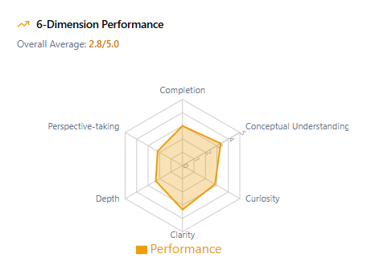
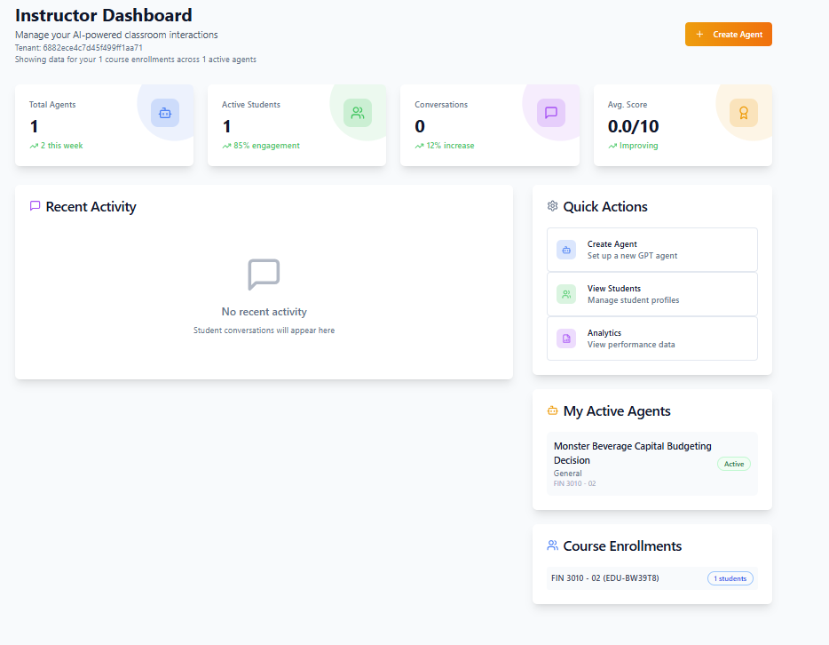
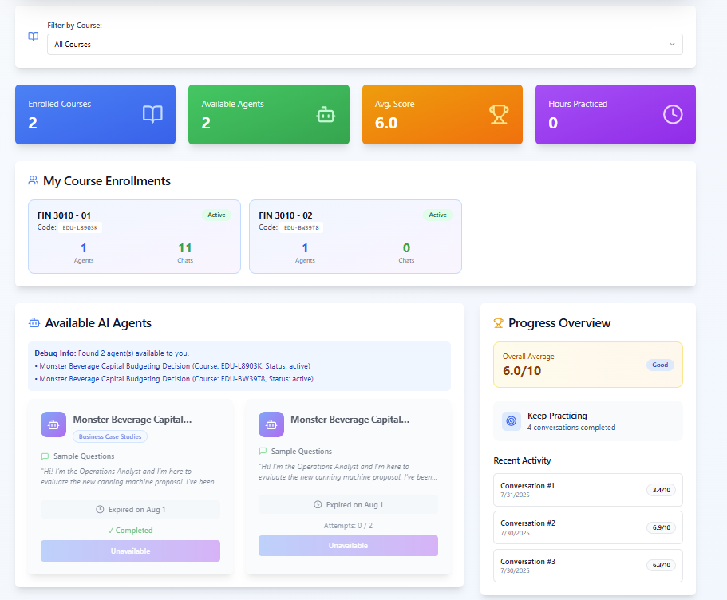
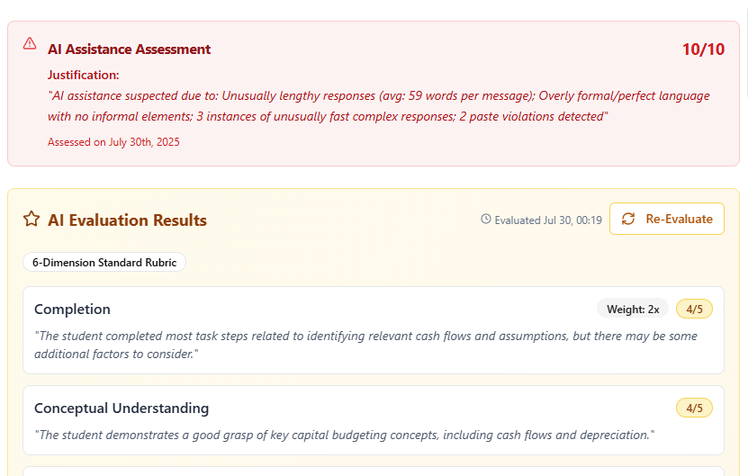

# CognitoAI: Comprehensive User Manual for Educational GPT Evaluation

## 📋 Table of Contents
1. [Overview](#overview)
2. [System Features](#system-features)
3. [Getting Started](#getting-started)
4. [Instructor Guide](#instructor-guide)
5. [Student Guide](#student-guide)
6. [Evaluation System](#evaluation-system)
7. [Anti-Cheating Mechanisms](#anti-cheating-mechanisms)
8. [Analytics & Reporting](#analytics--reporting)
9. [Troubleshooting](#troubleshooting)

## 🌟 Overview

**CognitoAI** (cognitoai.net) is a comprehensive platform that enables instructors to evaluate student conversations with customized GPTs and provides automated grading based on a 6-dimension evaluation matrix. The platform combines AI-powered assessment with academic integrity features to create a robust educational evaluation environment.

### Key Benefits
- **Automated Assessment**: AI-powered evaluation based on predefined criteria
- **Immediate Feedback**: Real-time performance insights for students
- **Academic Integrity**: Built-in anti-cheating mechanisms
- **Comprehensive Analytics**: Detailed performance tracking and reporting
- **Student Progress Monitoring**: Automated summary generation of student development

## 🎯 System Features

### Core Functionality
- **Multi-Role Dashboard**: Separate interfaces for instructors, students, and administrators
- **GPT Agent Management**: Create and manage custom educational GPTs
- **Real-time Conversation Monitoring**: Live tracking of student-GPT interactions
- **Automated Grading**: 6-dimension performance evaluation matrix
- **Anti-Cheating Detection**: Advanced mechanisms to ensure academic integrity
- **Performance Analytics**: Comprehensive reporting and insights
- **Student Profile Management**: Detailed tracking of individual progress

### 6-Dimension Evaluation Matrix

The platform evaluates student conversations across six key dimensions:
1. **Critical Thinking**: Analysis depth and reasoning quality
2. **Content Understanding**: Grasp of subject matter concepts
3. **Communication Skills**: Clarity and articulation in responses
4. **Problem-Solving**: Approach to challenges and solution development
5. **Engagement Level**: Active participation and question quality
6. **Knowledge Application**: Real-world application of concepts

## 🚀 Getting Started

### System Requirements
- Modern web browser (Chrome, Firefox, Safari, Edge)
- Stable internet connection
- ChatGPT Plus account (for custom GPT access)

### Account Setup
1. **Visit**: [cognitoai.net](https://cognitoai.net)
2. **Register**: Create account with institutional email
3. **Role Selection**: Choose instructor or student role
4. **Profile Setup**: Complete profile information
5. **Course Enrollment**: Join or create courses as appropriate

## 👨‍🏫 Instructor Guide

### Instructor Dashboard Overview

The instructor dashboard provides comprehensive tools for:
- **Course Management**: Create and manage multiple courses
- **Student Enrollment**: Add and organize student participants
- **GPT Agent Deployment**: Configure custom educational GPTs
- **Real-time Monitoring**: Track active student conversations
- **Performance Analytics**: Access detailed evaluation reports

### Setting Up Your First Course

#### Step 1: Course Creation
1. Navigate to **Course Management**
2. Click **"Create New Course"**
3. Enter course details:
   - Course name and description
   - Semester/term information
   - Learning objectives
4. Save course configuration

#### Step 2: GPT Agent Configuration
1. Access **Agent Management** section
2. Select **"Add New GPT Agent"**
3. Configure agent parameters:
   - Educational role and objectives
   - Subject matter focus
   - Interaction guidelines
   - Assessment criteria
4. Link agent to specific course

#### Step 3: Student Enrollment
1. Go to **Student Management**
2. Choose enrollment method:
   - **Manual Addition**: Add students individually
   - **Bulk Import**: Upload student roster
   - **Self-Enrollment**: Provide course code for student registration
3. Assign students to appropriate course sections

### Monitoring Student Progress

#### Real-time Conversation Tracking
- **Live Dashboard**: View active student conversations
- **Intervention Alerts**: Receive notifications when students need help
- **Progress Indicators**: Monitor completion status and engagement levels

#### Evaluation Reports
- **Individual Performance**: Detailed student assessment reports
- **Class Analytics**: Overall class performance trends
- **Comparative Analysis**: Benchmark against learning objectives

### Grading and Assessment

#### Automated Evaluation Process
1. **Conversation Completion**: Student finishes GPT interaction
2. **AI Analysis**: System analyzes conversation across 6 dimensions
3. **Score Generation**: Automated scoring based on predefined rubrics
4. **Report Creation**: Comprehensive evaluation report generated
5. **Feedback Delivery**: Immediate feedback provided to student

#### Manual Review Options
- **Score Adjustment**: Modify AI-generated scores when necessary
- **Additional Comments**: Add personalized instructor feedback
- **Grade Override**: Complete manual grading for special cases

## 👨‍🎓 Student Guide

### Student Dashboard Overview

The student dashboard includes:
- **Available GPT Agents**: Access to course-specific educational GPTs
- **Conversation History**: Record of all previous interactions
- **Performance Tracking**: Progress monitoring and grade reports
- **Assignment Calendar**: Upcoming tasks and deadlines

### Starting a Conversation

#### Accessing GPT Agents
1. **Dashboard Navigation**: Go to "Available Agents" section
2. **Agent Selection**: Choose appropriate GPT for your assignment
3. **Conversation Launch**: Click "Start Conversation"
4. **Context Setup**: Review assignment requirements and guidelines

#### Best Practices for Effective Conversations
- **Read Instructions Carefully**: Understand assignment objectives
- **Engage Thoughtfully**: Provide detailed, well-reasoned responses
- **Ask Follow-up Questions**: Demonstrate curiosity and deeper thinking
- **Apply Course Concepts**: Connect discussions to class materials
- **Stay Focused**: Maintain relevance to learning objectives

### Understanding Your Evaluation

#### Performance Reports
Students receive detailed feedback across the 6-dimension matrix:
- **Quantitative Scores**: Numerical ratings for each dimension
- **Qualitative Feedback**: Specific improvement suggestions
- **Trend Analysis**: Progress tracking over time
- **Goal Setting**: Recommendations for future development

#### Improvement Strategies
- **Review Feedback**: Carefully read evaluation comments
- **Identify Patterns**: Look for recurring strengths and weaknesses
- **Practice Areas**: Focus on dimensions needing improvement
- **Seek Help**: Contact instructor for additional support

## 🔍 Evaluation System

### AI-Powered Assessment Engine

The platform uses advanced AI algorithms to evaluate student conversations based on multiple criteria:

#### Content Analysis
- **Concept Recognition**: Identification of key subject matter concepts
- **Depth Assessment**: Evaluation of analysis thoroughness
- **Accuracy Verification**: Checking factual correctness
- **Connection Making**: Assessment of interdisciplinary thinking

#### Communication Evaluation
- **Clarity Assessment**: Evaluation of expression quality
- **Coherence Analysis**: Logical flow of ideas
- **Engagement Measurement**: Active participation indicators
- **Question Quality**: Assessment of inquiry sophistication

#### Critical Thinking Metrics
- **Reasoning Patterns**: Analysis of logical progression
- **Evidence Usage**: Evaluation of support for arguments
- **Assumption Challenging**: Assessment of critical evaluation skills
- **Problem-Solving Approach**: Analysis of solution strategies

### Scoring Methodology

#### Dimension Scoring (1-10 Scale)
- **1-3**: Below Expectations
- **4-6**: Approaching Expectations
- **7-8**: Meets Expectations
- **9-10**: Exceeds Expectations

#### Weighted Scoring Options
Instructors can customize dimension weights based on:
- Course learning objectives
- Assignment specific requirements
- Student level and experience
- Subject matter emphasis

## 🛡️ Anti-Cheating Mechanisms

### Advanced Detection Systems

The platform employs multiple layers of academic integrity protection:

#### Paste Detection System
**How it Works**: The system monitors typing patterns and input methods to detect when students copy and paste content from external sources.

**Detection Mechanisms**:
- **Typing Speed Analysis**: Identifies unnaturally fast text input
- **Pattern Recognition**: Detects formatting inconsistencies
- **Content Flow Monitoring**: Tracks sudden changes in writing style
- **Timestamp Analysis**: Identifies suspicious timing patterns

**Response Actions**:
- **Real-time Alerts**: Immediate notification to instructors
- **Student Warnings**: Automatic prompts about academic integrity
- **Conversation Flagging**: Mark sessions for manual review
- **Score Adjustments**: Potential penalties for detected violations

#### AI-Generated Content Detection
**Content Analysis**: Advanced algorithms identify responses that may be generated by AI tools other than the assigned educational GPT.

**Detection Features**:
- **Writing Style Analysis**: Comparison with student's historical patterns
- **Complexity Evaluation**: Assessment of response sophistication level
- **Topic Coherence**: Evaluation of subject matter alignment
- **Response Timing**: Analysis of input speed vs. content complexity

#### Collaboration Detection
**Multi-Student Analysis**: System identifies when multiple students provide similar or identical responses.

**Detection Methods**:
- **Response Similarity Scoring**: Comparison across student submissions
- **Timing Correlation**: Identification of simultaneous submissions
- **Pattern Matching**: Detection of shared source materials
- **Network Analysis**: Tracking of student interaction patterns

### Academic Integrity Reporting

#### Violation Documentation
- **Detailed Logs**: Complete record of detected irregularities
- **Evidence Compilation**: Screenshots and data supporting findings
- **Student Notification**: Automatic alerts about potential violations
- **Instructor Dashboard**: Centralized view of academic integrity status

#### Response Protocols
- **Warning System**: Progressive alerts for minor infractions
- **Investigation Tools**: Resources for thorough violation review
- **Remediation Options**: Educational interventions and retake opportunities
- **Documentation Standards**: Proper record-keeping for institutional requirements

## 📊 Analytics & Reporting

### Instructor Analytics

#### Class Performance Overview
- **Aggregate Scores**: Overall class performance across all dimensions
- **Trend Analysis**: Performance changes over time
- **Comparative Metrics**: Benchmarking against previous terms
- **Learning Objective Alignment**: Progress toward course goals

#### Individual Student Insights
- **Detailed Profiles**: Comprehensive view of each student's progress
- **Strength/Weakness Analysis**: Identification of development areas
- **Engagement Patterns**: Participation and interaction trends
- **Intervention Recommendations**: Suggested support strategies

#### Assignment Analytics
- **Completion Rates**: Tracking of assignment submission patterns
- **Time Investment**: Analysis of student effort and engagement
- **Difficulty Assessment**: Identification of challenging concepts
- **Success Predictors**: Early indicators of student performance

### Student Analytics

#### Personal Dashboard
- **Progress Tracking**: Visual representation of development over time
- **Goal Monitoring**: Progress toward learning objectives
- **Peer Comparison**: Anonymous benchmarking against classmates
- **Achievement Badges**: Recognition of milestones and improvements

#### Performance Insights
- **Strength Identification**: Areas of demonstrated competency
- **Growth Opportunities**: Specific areas for improvement
- **Study Recommendations**: Personalized learning suggestions
- **Resource Connections**: Links to relevant course materials

### Automated Student Summary Generation

The platform automatically generates comprehensive summaries of student performance and development:

#### Summary Components
- **Performance Overview**: Overall assessment across all interactions
- **Learning Progression**: Demonstration of skill development over time
- **Key Achievements**: Notable accomplishments and breakthroughs
- **Areas for Growth**: Specific recommendations for continued development
- **Instructor Insights**: Professional observations and recommendations

#### Generation Process
1. **Data Compilation**: Aggregation of all student interactions and assessments
2. **Pattern Analysis**: Identification of trends and developments
3. **AI Synthesis**: Intelligent summarization of key insights
4. **Quality Review**: Automated validation of summary accuracy
5. **Delivery**: Distribution to students and instructors

## 🔧 Troubleshooting

### Common Issues and Solutions

#### Login and Access Problems
**Issue**: Cannot access platform or specific features
**Solutions**:
- Verify internet connection stability
- Clear browser cache and cookies
- Check account permissions and role assignment
- Contact administrator for account status verification

#### GPT Agent Connectivity
**Issue**: Unable to start or maintain conversations with educational GPTs
**Solutions**:
- Ensure ChatGPT Plus subscription is active
- Verify GPT agent configuration
- Check browser compatibility
- Refresh page and retry connection

#### Evaluation Delays
**Issue**: Scores and feedback not appearing promptly
**Solutions**:
- Allow additional processing time for complex conversations
- Check system status for maintenance updates
- Verify conversation completion status
- Contact support for urgent evaluation needs

#### Data Synchronization
**Issue**: Information not updating across different platform sections
**Solutions**:
- Refresh browser page
- Log out and log back in
- Clear browser cache
- Report persistent issues to technical support

### Technical Support

#### Contact Methods
- **Help Desk**: Available through platform help section
- **Email Support**: [support@cognitoai.net](mailto:support@cognitoai.net)
- **Documentation**: Comprehensive knowledge base available
- **Video Tutorials**: Step-by-step guidance for common tasks

#### Response Times
- **Critical Issues**: Within 2 hours during business hours
- **General Support**: Within 24 hours
- **Feature Requests**: Within 1 week for evaluation
- **System Maintenance**: Scheduled with advance notice

## 📞 Additional Resources

### Training and Support
- **Instructor Onboarding**: Comprehensive training sessions
- **Student Orientation**: Platform introduction and best practices
- **Webinar Series**: Regular training updates and feature announcements
- **Best Practices Guide**: Educational strategies for optimal results

### Community
- **User Forums**: Peer support and experience sharing
- **Feature Requests**: Community-driven platform improvements
- **Success Stories**: Examples of effective implementation
- **Research Partnerships**: Collaboration opportunities for educational research

---

*For the latest updates and detailed technical documentation, visit [cognitoai.net](https://cognitoai.net)*
